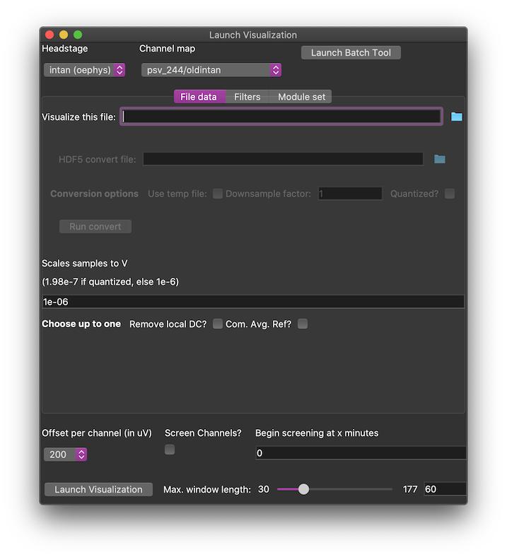

# Data Initialization

1. [Data file info](#metadata-preproc)
    1. [File data types and HDF5 conversion](#headstages)
    1. [Other metadata](#other-metadata)
    1. [Filtering](#filtering)
3. [Other runtime options](#runtime-opts)
4. [Launching scroller](#launching)

## Dataset info and preprocessing 

The (currently bare-bones) setup.py installs a single entry point script scalled `launch_scroller.py`, which opens a dataset initialization screen.

### Set the headstage 

Multiple headstage/DAQ combinations are supported--**this option should be set first**.
Depending on this choice, the "File data" panel will require different metadata and file types.
Choose the file under "Visualize this file"--generally speaking, the data needs to be converted to HDF5.

---

**How to convert somewhat typical files**

| Data source    | File type | Convert with |
| -------------- | --------- | ------------ |
| "Active" (NI)  | .tdms     | ecogdata     |
| Mux types (NI) | .tdms     | ecogdata     |
| OpenEphys      | .continuous | this app   |
| RHD Controller | .rhd      | rhd-to-hdf5  |

Much more rare types

| Data source    | File type | Convert with |
| -------------- | --------- | ------------ |
| StimV4 (NI)    | .tdms     | ecogdata     |
| Blackrock (converted)    | HDF5      | n/a |

Currently most conversion happens via tools and/or methods from [ecogdata](https://github.com/miketrumpis/ecogdata/).
RHD files should be joined and/or converted with [rhd-to-hdf5](https://github.com/miketrumpis/rhd-to-hdf5/).
An exception is `.continuous` files, which may be converted in this program.
Under the "intan (oephys)" headstage panel, select a single `.continuous` file, and then run conversion. 
When conversion is finished, the HDF5 file will become selected to visualize.
The "Blackrock" option refers to very old datasets (ns5 or ns6 format) that were probably converted to HDF5 using [these tools](https://github.com/miketrumpis/ecogdata/tree/master/matlab_tools).

---

Another file type option is "unknown". You can load an arbitrary HDF5 file if it contains a multichannel (channel x time) timeseries ("Data field") and a sampling rate ("Fs field"). You also need to specify the scaling factor to translate array values to Volts.

### Other metadata 

**Array and sampling rate**

The basic file data type needs to know the "Data field" (name of the HDF5 timeseries array) and the "Fs field" (name of the HDF5 key for sampling rate).
These choices will be visible only if the fields are not guessed based on headstage type.

---

**Channel maps**

Choose one of the channel map names. 
One or two maps (e.g. "psv_244") require extra connector-level info, as different amplifiers (e.g. "intan64" or "intan64_new") may be connected at each connector. 
The shortcuts "psv_244/newintan" and "psv_244/oldintan" indicate that all amplifers were the same.
Exceptional options:

* **active**: the active array mappings are based on acquisition settings specified in the File data panel
* **unknown**: for unmapped devices, a dummy map can be specified using
  + Number of signal channels
  + Number of skipped channels
  + Pseudo "grid" geometry (rows, columns)
* **pickled**: this assumes that the HDF5 file includes a pickled ChannelMap object (maybed saved through `save_bunch`)
* **settable**: to be used programmatically (a map name can be set on the launch object via Python code commands)

---

**Data quantization/gain settings**

There is a field to specify the scale needed to bring data samples to Volts units. This is typically guessed based on the headstage & file type.

---

**Active array fields**

Specific metadata for active array recordings:

* **daq**: DAQ interface, e.g. "2t-as daq v1"
* **headstage**: headstage connector, e.g. "zif26 to 2x uhdmi"
* **electrode**: electrode name, e.g. "actv_64"

---

**MUX series headstages**

*documentation TODO, but hopefully default settings work*

### Filters tab 

Filters can be added to a list by choosing a filter type (default "butterworth") and pressing "Add filter" (actually the filter type can also be changed later).
When selected from the list, each filter has a panel of filter specs.
In the simplest case, you can set passband edges and the filter order, and some other filters require stopband specifications.
For all linear translation invariant (LTI) filters, you can optionally forward/reverse filter, to eliminate phase delays.

Other features:

* Filter items in the list can be reordered (right click list index) or removed.
* Filter pipelines can be saved to human & machine readable files, and reloaded for future use

## Further runtime options 

### Modules tab

Special purpose analysis modules are attached at runtime. Specify the set of modules using the set editor in this tab.

### Scroller settings and channel screening

Before launching the scroller, you may want to set a cap on the amount of the timeseries that can be active at one time ("Max. window length")
You may want to pre-screen channels to remove dead or noisy signals. 
Choose "Screen Channels" and also choose a number of minutes to advance in the series before screening (if you want to avoid startup transients).

## Last Step: Launch Visualization 

After filtering and/or channel selection, move onto [using the scroller](scroller_usage.md)
