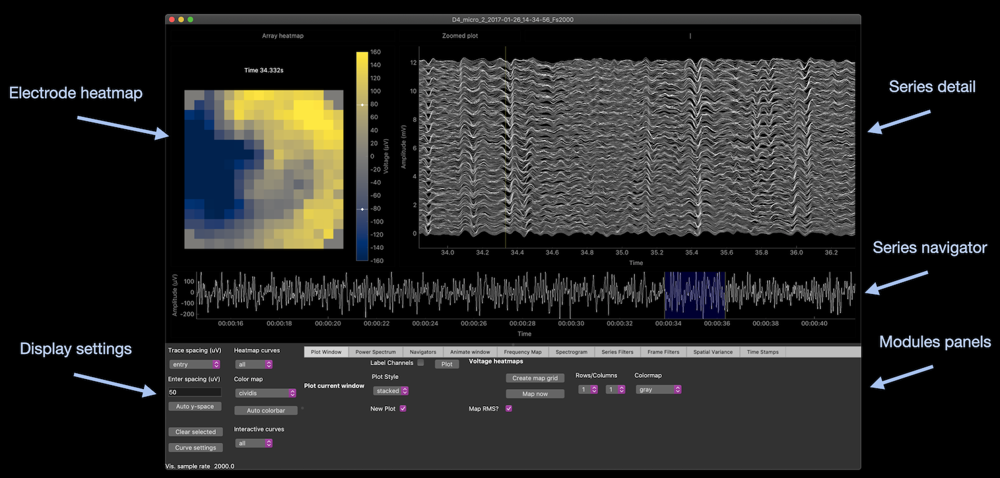
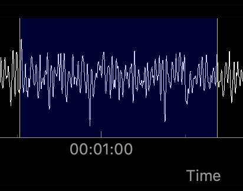
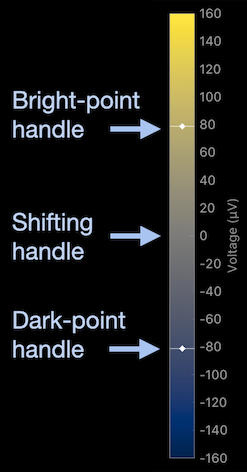
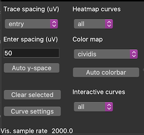
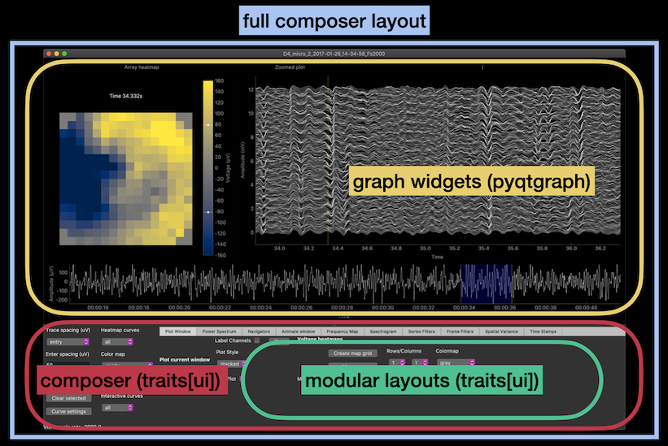

# LFP scroller basic features

The LFP scroller UI is composed of a main graphing panel, with a heatmap and two timeseries views, and a bottom panel with multiple widgets for display settings and miscellaneous timeseries operations. This scroller is intended to handle very large datasets: data is only loaded on-demand from a file-based array. For this reason, expect *some* lag in the responsiveness of interactions.

Contents

1. [Scroller widgets](#scroller-overview)
    1. [Series navigator plot](#navigator)
    2. [Series detail plot](#detail)
    3. [Electrode heatmap](#heatmap)
1. [Display settings and modules](#traits-panel)
1. [GUI composition](#gui-composition)

## Scroller widgets 

The main panel is used to scroll, or "scrub" through a multi-channel electrophysiological timeseries. 
These subpanels are graphing widgets with some intuitive pan (left-click and drag) & zoom (right-click and drag) mouse controls.
The two series plots have an alternate mouse mode, which is engaged by pressing the shift key.
The components are yoked together to select and display the same segment of data:

| Graph item | Purpose | Yoking | Primary mode | Alt mode |
| ---------- | ------- | ------ | ------------ | -------- |
| heatmap | spatial view of detail segment | depicts current segment | RMS of detail window | voltage at selected time |
| series detail | multichannel stack of current segment | linked to navigator selection | drag & zoom | mouse selects time points |
| series navigator | navigate full record via aggregate series | blue region selects detail segment | drag & zoom | jump region to mouse click |

### Navigator series plot 

The navigator plot is used to quickly scan through the full recording. 
The default aggregate series is the channel mean, but more series can be defined through the "Navigators" module.
The detail segment is selected by a region item (LinearRegionItem) that can be dragged and expanded within the plot:

* dragging: click within region and move with mouse
* expanding: highlight region edge and move with mouse

You can also do jump navigation by pressing the shift key and clicking to a new point in the recording.

*Tip*: Region expansion is somewhat "debounced" to prevent redundant commands to load data. For good results, try to use quick & precise mouse movements while expanding.

### Detail plot 

The detail panel shows the current recording segment over all channels. 
This display is yoked to the navigator region bidirectionally, so panning and zooming in this plot also updates the navigator region.
In the alternate mouse mode (with shift key pressed), the mouse position defines a selected time point, which updates the heatmap display.

*Tip 1*: Small region expansions are pre-cached, but larger ones need to cache out to file. 
The detail plot is well suited for fine adjustments to the length of the current segment (zooming out), while the navigator region is better suited for larger expansions of the detail segment.

*Tip 2*: there is an "A" button when hovering that can reset the axes scale to automatically cover the full range (helpful after manipulating the plot region).

Individual traces in the detail plot can also be clicked to mark them as "selected" (they form a selected curves set). 
Clicking again toggles selection.
Selected curves are displayed with a shadow trace, and annotated with their grid positions.
Many modules can work with either "all" curves, or "selected" curves (or any other curve collection that may later be added).[^1][^2]

Many detail display aspects are reflected in the bottom left panel (see the [display settings](#traits-panel) section).

### Grid heatmap 

The heatmap shows the RMS voltage of each electrode over the detail segment, or the instantaneous voltage in alternate mouse mode.
Manipulating the colorbar is quirky, but logical.

The colorbar handle works like the region widget in the navigator panel. You can shift the dark- and bright-points separately by gradually "tugging" the edge handles up or down. 
The end-points should shift by increments of 5 or 10 micro-Volts, and when released, the handles snap back.
You can also tug the entire region up or down, to shift the center point.
The color limits can be set automatically in the display settings panel.

## Settings and modules 

The bottom panels of the app contains display settings (left side), and a tabbed container of the modules (right side).

The display settings affect both the detail plot and the heatmap

Detail settings
* **Trace spacing**: use preset trace spacing, or "entry" to use the value entered below, or press "Auto y-space"
* **Clear selected**: clear (empty) the selected curve collection
* **Curve settings**: pop up a panel to adjust curve colors and line widths
* **Vis. sample rate**: data are visually downsampled as the selected region grows--this rate shows the number of data points per trace per second

*Tip*: (**important**) it seems that display refreshes are notably slower for line widths greater than 1.

Heatmap settings
* **Heatmap curves**: this choice affects which curve collection is mapped to the image[^1]
* **Color map**: selects the color mapping
* **Auto colorbar**: automatically set the dark- and bright-point limits

Another option (**Interactive curves**) actually affects which curve collection the modules should use.[^2]

---

The tabs select between special purpose visualization modules (detailed elsewhere: TODO).
However, to get a basic sense, try plotting the current window to get a high quality (matplotlib) graph that can be saved in pdf, or other formats.

## GUI composition 

This section describes the composition of the application from code component models.
The GUI elements are a mixture of [pyqtgraph](https://pyqtgraph.readthedocs.io/en/latest/) and [Traits](https://docs.enthought.com/traits/traits_user_manual/defining.html) + [TraitsUI](https://docs.enthought.com/traitsui/).

* pyqtgraph: more or less wraps graphing widgets defined by the Qt C++ library
* traits[ui]: python (+magic) based system for "Model, View, Controller" style applications

The main "composer" app is a Traits[UI] object that is composed of 

1. the "scroller" component (pyqtgraph based)
2. some settings (these are so-called "traits")
3. a list of modular components (the modules, which are stand-alone Traits[UI] apps)

The main app defines a layout for these components, which primarily specifies how to display its own traits in the setting panel.
The major sub-components (i.e. the scroller and each module) specify their own layout, but are placed in the main window by the composer.
For this reason, the "composer" object (a `VisWrapper`) is fairly light on code.
The scroller and modular components vary in complexity, depending on the scope of their analysis and functionality.

[^1]: Curves may be added via modules--e.g., adding a power envelope transform
[^2]: Not all modules are aware of curve collections yet.
